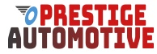

# Prestige Automotive | Milestone Project 1

 The website aims to target car enthusiasts and owners who are looking to modify or better their precious vehicle. The website aims to provide three main services which target the look 
 and performance via a car wrapping service which consists of a material which is used to wrap over the car panels to change the colour and texture of the car. The second service consists
 of detailing which is a very focused form of cleaning the car both internally and externally. The third service is boost to the engines power, this is basically a computer chip which is coded
 specifically to the engine of the car to increasse the power output. The website will have a gallery to showcase the services and also provide a form of contact to make enquiries. 
 The key aim is to attract more business by providing a showcase of services and also offering a method of enquiry which may be more convenient to clients via a form. 

 
## UX
 
Use this section to provide insight into your UX process, focusing on who this website is for, what it is that they want to achieve and how your project is the best way to help them achieve these things.

        First Time Visitor Goals.

-	As a first-time visitor to the website. I want to understand the Website and what it offers. 
-	I would like to be able to navigate clearly through the website to find exactly what I am looking for. 
-	I want to see the different services available and clearly understand which one is best for me. 
-	I would like to know indicative pricing to see if these services are something within budget. 
-	I would like as a first-time user to be able to see clear images of the previous work carried out and also provide social media links where this can be viewed at a third-party perspective. 
-	I want to know if there are any first-time buyer offers available.
-	I want to be able to get in touch with a member of staff to make an enquiry on pricing if the service is dependent on further information/insight. 

        Returning Visitor Goals.

-	I want to know if any new products or services have been added.
-	I would like to see if the gallery has been updated with the latest projects/work.
-	I would like to know if there are any loyalty schemes for regular users/buyers.
-	I want to know if I can get in contact to proceed with a quotation/service. 
-	As a car enthusiast I want to know what the best service is to maintain or modify my car.

    
        Site Owners Goals.

-	As the owner I want site visitors to be able to freely and comfortably navigate through the website and clearly find what they are looking for.
-	I want the visitors to be able to reach out and ask for more information in any page via the form available for a quotation/more information.
-	I want visitors to be able to browse through the different services available and select which one they need. Then through the form lead generator be able to submit their information and request for contact.
-	I want visitors to feel like they want to come back to the website and use it regularly by including images of previous work/incentives of promotions for first time buyers and also promotions to loyalty and returning customers.

        Design

- #### Colour Scheme
    - The three main colours used throughout are red white and blue. These three simple colours were chosen to provide a simple and clean feel to the site.

- #### Typography 
    -    The Lato font is my main font which I chose to use throughout. I like how clean and simple this text looks, it is very readable and attractive. I used Sans Serif as my fallback font as this is one of the most common fonts.

- #### Imagery 
    - The imagery is key when trying to sell a service as the user needs to be able to see the end result. I chose professional imagery of the services being carried out to bring a sense of class to the brand image. The Gallery is also very key as this is 
    somthing many people like to see when deciding if they would go ahead with the service. Mixing informative text with the imagery ina. form of a pop up modal was also key as a blank image on it's own does not appeal to many people. 

- #### Wireframes 
    
    Here you can see the wireframe versions at desktop, tablet and mobile device. (Please scroll right to view mobile wireframe)

    - [Home Wireframe](https://github.com/BesnikShala/Milestone-project-1/blob/master/wireframes/home-page-about.png)

    - [Services Wireframe](https://github.com/BesnikShala/Milestone-project-1/blob/master/wireframes/services-page.png)

    - [Gallery Wireframe](https://github.com/BesnikShala/Milestone-project-1/blob/master/wireframes/gallery-page.png)

    - [Contact Wireframe](https://github.com/BesnikShala/Milestone-project-1/blob/master/wireframes/contact-page.png)

# Features

### Existing Features
- Feature 1 - The home page will have an interactive navbar which allows the user to be able to navigate through the website easily. It will be a sticky navbar so no matter how far down the page they go the user can always
have the ability to use the navbar. 

- The brand image/name has a link to the home page so users can eaily return to the main page of the website at any moment. 

- The footer contains information about the business but also links to social media accoounts, this is on all pages so users can follow on social media. 

- The navigation bar has clear and indicative sign of which page you are currently on. Screen readers will also know which page they are currently on. 

- The site will include a carousel of images for the services to browse through each one and view the service images.

- The site will include a form which is designed to make enquiries on price or even ask a question. 

- The site will also include a full gallary page where previous work can be viewed. 

- A modal implemented in the gallary to allow users to enlarge the images and also view text information for that image.

- Flowing feature on scroll. Using AOS CDN as the user scrolls through the site the content animates fading in from the sides. 

## Features Left to Implement

- 

## Technologies Used

In this section, you should mention all of the languages, frameworks, libraries, and any other tools that you have used to construct this project. For each, provide its name, a link to its official site and a short sentence of why it was used.

- [JQuery](https://jquery.com)
    - The project uses **JQuery** to simplify DOM manipulation.

- [Bootstrap](https://getbootstrap.com/)
    - Bootstrap was included in the website to provide a good structure and quick start to the website. I found it useful to get the shell of the documentation but ultimately styled it my own way. 

- [Hover.css](http://ianlunn.github.io/Hover/)
    - I came accross Hover.css in a previous module and I included this because you have the ablity to view each effect before you use it. The application is very quick and easy and the results are great. (Credit Ian Lunn)

- [AOS Animate on Scroll](https://github.com/michalsnik/aos)
    - I came accross this feature on many websites. My mentor also showed me an example website which included this feature. I decided to use this feature as it adds flow to the website especially when scrolling through content. 

- [Google Fonts](https://fonts.google.com/)
    - I chose to use Google Fonts for all my text within the website. The reason being I am confident that this should not fail or any issues come from this imported font. 

- [Font Awesome](https://fontawesome.com/)
    - I came accross this also the previous modules istructed by senior product developer Matt Rudge. I included it in my website as the icons are very simple and easy to see, the code is also very easy to implement and style.

# Testing

## Code Validation

[W3C HTML Validator](https://validator.w3.org/) To validate HTML code.

- One error found for index.html on line 150 and immediately fixed. Left over attribute which was only partially deleted.

- multiple errors for services.html due to aria-labelledby not matching id name. This issue was fixed by matching the id's to the aria-labelledby.

- One error on contact.html, used a paragraph tag within a span. Fixed by changing span to a div. 

[W3C CSS Validator](https://jigsaw.w3.org/css-validator/) To validate HTML code.

- One error in code. Text decoration had a specified size in px before the colour and style. Fixed by specifying text-decoration-thickness. 

## Deployment

# Credits

## Content

## Media

[Freepik](https://www.freepik.com/)

- The photos used in this site were obtained from freepik.com (credit photographer @Prostooleh)

[Pexels](https://www.pexels.com/)

- Gallery images used in this site were obtained from pexels.com. 

## Acknowledgements

